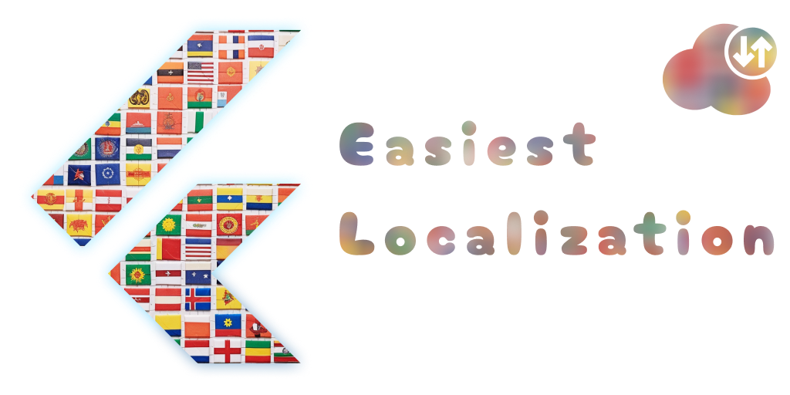

# Easiest Remote Localization



---

**Easiest Remote Localization** is a companion Flutter package that extends the capabilities of [Easiest Localization](https://pub.dev/packages/easiest_localization) by enabling remote localization support. Effortlessly retrieve and integrate JSON or YAML localization files from any remote source, allowing dynamic updates and additions of languages without the need to update your app.

## Installation

```yaml
dependencies:
  easiest_remote_localization: ^1.0.0
```

## Setup

The initialization process is only 4 steps and extremely simple:

```dart
import 'package:easiest_localization/easiest_localization.dart';
import 'package:easiest_remote_localization/easiest_remote_localization.dart'; // <- 1️⃣ Import package
import 'package:flutter/material.dart';
import 'package:localization/localization.dart';

Future<void> main() async {
  runApp(const MyApp());
}

class MyApp extends StatefulWidget {
  const MyApp({
    super.key,
  });

  @override
  State<MyApp> createState() => _MyAppState();
}

class _MyAppState extends State<MyApp> {
  /// 2️⃣ Create remote providers - as many, as you want. But usually, you will need only one
  late final List<LocalizationProvider<LocalizationMessages>> remoteProviders = [
    RemoteLocalizationProvider<LocalizationMessages>(
      /// Set the cache duration
      /// During this time, the user will use the previously downloaded content
      cacheTTL: const Duration(hours: 3),

      /// If necessary - you can configure in detail how exactly the network request will be executed with Dio' BaseOptions
      options: BaseOptions(),
      sources: [
        /// Describe the “sources” for each of the supported languages
        ///
        /// Hint - since “source” is a very simple dataclass, it is quite easy to implement getting the sources themselves completely remotely.
        /// This way you can change not only the content of already supported languages, but also add new languages dynamically.
        RemoteSource(
          locale: Locale('en'),
          url: 'https://indieloper.b-cdn.net/easiest_localization/en.json',
          type: SourceType.json,
        ),
        RemoteSource(
          locale: Locale('en', 'CA'),
          url: 'https://indieloper.b-cdn.net/easiest_localization/en_CA.json',
          type: SourceType.json,
        ),
        RemoteSource(
          locale: Locale('es'),
          url: 'https://indieloper.b-cdn.net/easiest_localization/es.json',
          type: SourceType.json,
        ),
        RemoteSource(
          locale: Locale('ru'),
          url: 'https://indieloper.b-cdn.net/easiest_localization/ru.json',
          type: SourceType.json,
        ),
      ],

      /// Specify factory `.fromJson` from the generated class with localized content
      /// If you have not changed the settings, this line will look exactly the same
      /// If you have changed the `class_name` parameter - this will be `<class_name>.fromJson`
      factory: (RemoteSource source, Json content) => LocalizationMessages.fromJson(content),
    ),
  ];

  @override
  Widget build(BuildContext context) {
    return MaterialApp(
      onGenerateTitle: (BuildContext context) => el.appTitle,

      /// 3️⃣ Use localizationsDelegatesWithProviders(remoteProviders) instead of localizationsDelegates
      localizationsDelegates: localizationsDelegatesWithProviders(remoteProviders),

      /// 4️⃣ And finally - use supportedLocalesWithProviders(remoteProviders) instead of supportedLocales
      supportedLocales: supportedLocalesWithProviders(remoteProviders),
      home: Home(),
    );
  }
}
```

> If you need 101% customization, you can use the low-level constructor `RemoteLocalizationProvider.raw` or implement your own `LocalizationProvider<LocalizationMessages>` class

## Caching

You can set a cache lifespan (or disable caching entirely), ensuring that the user only downloads localization data once during a certain interval. This allows the use of remote content even when the user is offline. Caching is implemented using `shared_preferences`.

## Safety

Since your app will always have a local version of the localization, even if remote content cannot be loaded due to backend issues or the user has no internet and the cache is empty, the user will still see the localization from the local version.

If you’ve added a new language that is only available remotely and has never been downloaded, a fallback language defined by you, or the first language in the list, will be shown instead.

## Dynamic Languages Expansion

As mentioned above, since you can store content for any language remotely, including new ones that are not yet in the app, this opens the possibility of adding new languages in real-time without needing to update the app.

## Best Practices

Maximum synergy can be achieved as follows: you develop the app and add or modify localized content. Simultaneously, comprehensive localization files will be generated if the corresponding setting is set to `save_merged_files_as: yaml` or `save_merged_files_as: json`. In this case, an additional `merged` folder will be created in the generated localization package, where you will find a list of JSON or YAML files that can be placed, for example, on your CDN. This process can be fully automated using CI/CD, allowing your users to receive the freshest content updates in real-time.

However, there are some limitations related to code generation: if you delete or change any keys in your local localization files, this will also affect the generated code and the files in the `merged` folder. As a result, users of older versions of your app will receive content from the remote source that may not contain the required fields (because they were deleted or the key names were changed). This, in turn, will cause an error when attempting to create localization classes from this modified content from the remote source. Ultimately, the user will see the local content. Therefore, when making changes that break backward compatibility, it makes sense to use versioning.

For this specific purpose, there is a `remote_version` parameter in the configuration. By default, it is set to `null`, which means that the generated (comprehensive) JSON/YAML files will be located at the path `.../generated_localization_package/merged/`. However, if you specify a version, for example, `2.0.0`, the files will be located at the following path: `.../generated_localization_package/merged/2.0.0/`, so each version of the localization will have its own set of files, and all of them will be accessible to your users.

---

A comprehensive example application is available at the link:

https://github.com/alphamikle/localization_battle